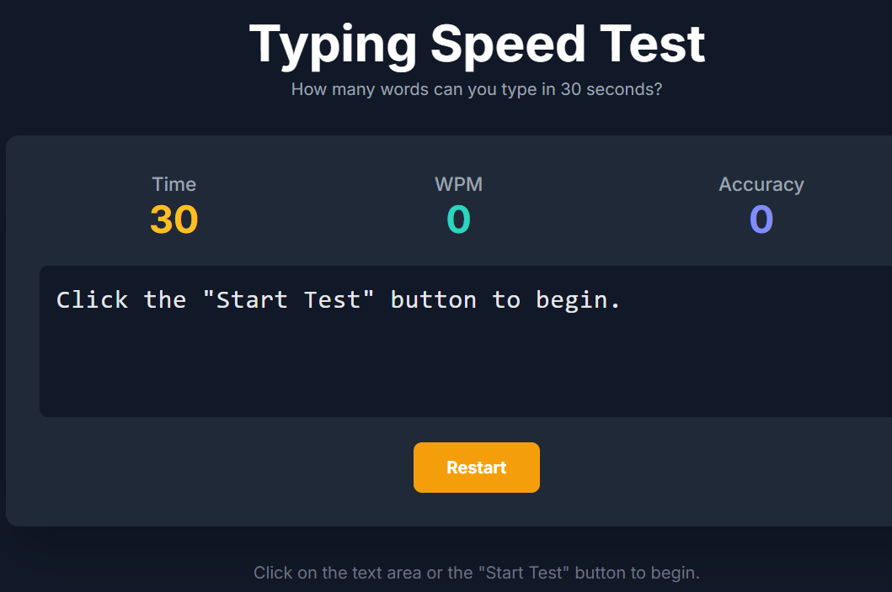

# Typing Speed Tester

A clean and simple web-based application to test your typing speed and accuracy. This project was built as a task for the Beginners League.

## 📜 Description

This Typing Speed Tester is a fun, interactive tool that measures how many words you can type in a 30-second interval. It provides real-time feedback on your performance, including Words Per Minute (WPM) and typing accuracy. The application is built with vanilla JavaScript and styled with Tailwind CSS, making it a great project for understanding core web development concepts.

## ✨ Features

  * **Real-time Feedback**: Get instant updates on your WPM and accuracy as you type.
  * **30-Second Challenge**: A quick and challenging time limit to test your speed under pressure.
  * **Random Paragraphs**: A variety of text samples are loaded randomly for a new experience each time.
  * **Visual Validation**: Characters are colored green for correct keystrokes and red for incorrect ones.
  * **Responsive Design**: A clean, modern UI that works beautifully on both desktop and mobile devices.
  * **Final Score Summary**: A clear results screen shows your final WPM and accuracy after the test is complete.

## 🛠️ Tech Stack

This project is built with fundamental web technologies, requiring no complex setup or compilation.

  * **HTML5**: For the basic structure and content of the application.
  * **Tailwind CSS**: A utility-first CSS framework used for modern and responsive styling.
  * **JavaScript (ES6)**: For all the client-side logic, including the timer, input handling, and score calculation.

## 🚀 How to Run

Running this project is incredibly simple.

1.  **Clone the repository:**
    ```bash
    git clone https://github.com/YOUR_USERNAME/Typing-Speed-Tester.git
    ```
2.  **Navigate to the directory:**
    ```bash
    cd Typing-Speed-Tester
    ```
3.  **Open the file:**
    Simply open the `index.html` file in your favorite web browser (like Chrome, Firefox, or Edge).

That's it\! No complex builds or dependencies are needed.

## 🧠 How It Works

The core logic of the application is handled by JavaScript:

1.  **Paragraph Loading**: A random paragraph is selected from a predefined array. Each character of the paragraph is wrapped in a `<span>` tag to allow for individual styling.
2.  **Input Handling**: A hidden `<input>` field is overlaid on the text display. This captures all user keystrokes without showing a separate text box.
3.  **Real-time Validation**: On each keypress, the typed character is compared to the expected character in the corresponding `<span>`. The span's color is updated to green (correct) or red (incorrect).
4.  **WPM & Accuracy Calculation**:
      * **WPM (Words Per Minute)** is calculated as `(Correctly Typed Words / 0.5)`.
      * **Accuracy** is calculated as `(Correct Characters / Total Typed Characters) * 100`.

Made with ❤️ by Bharath
